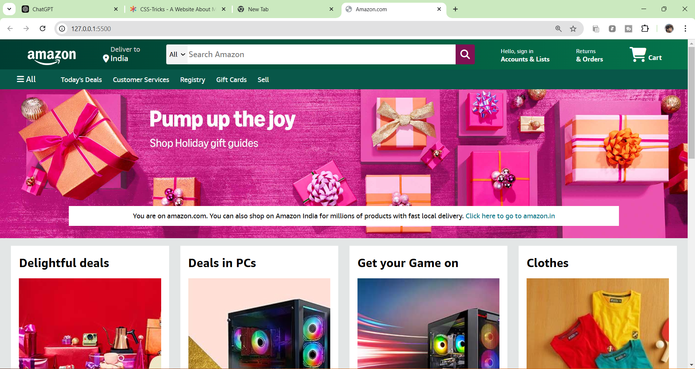
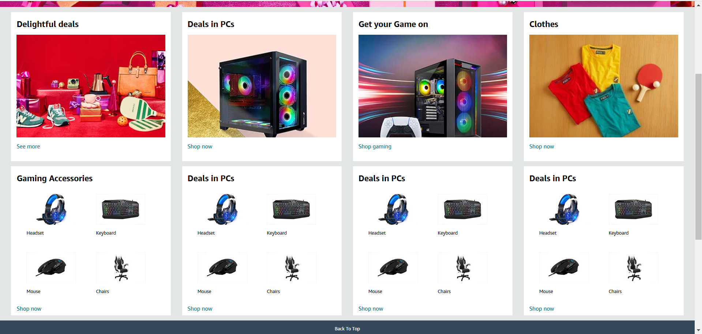
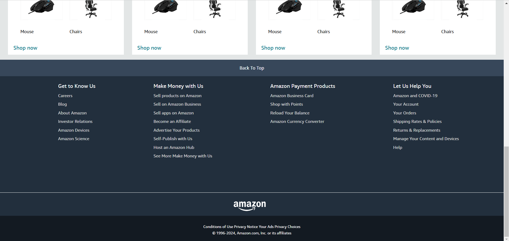

# Amazon Clone

Welcome to the **Amazon Clone** repository! This project demonstrates the practical application of CSS and HTML to create a responsive and visually appealing clone of the Amazon website. It's a great resource for learning layout, styling, and responsive design techniques.

---

## 📂 Project Overview

This project is designed to:
- Showcase how CSS can be used to style and structure complex websites.
- Implement a responsive design for seamless viewing on different devices.
- Replicate key elements of the Amazon website, such as the header, product listings, and footer.

---

## 🚀 Getting Started

To view and experiment with this project:

1. **Clone the Repository**:
   ```bash
   git clone https://github.com/sinha001/Amazon-Clone.git

2. **Navigate to the Project Folder**:
    ```bash
    cd Amazon-Clone

3. **Open the `@index.html` File: Use your preferred web browser to view the examples and exercises.**:
    ```bash
    open index.html

4. **Explore and Modify**: 
- Review the code to understand the implementation.
- Experiment with CSS styles to see how changes affect the layout and design.

---

## 🛠 Prerequisites

Before running or modifying this project, ensure you have:

- Basic knowledge of HTML and CSS.
- A code editor (e.g., VS Code, Sublime Text, or Atom).
- A modern web browser for testing (e.g., Chrome, Firefox, or Edge).

---

## 🌟 Features

- **Responsive Design**: Adaptable layouts for desktop, tablet, and mobile views.
- **Custom Styling**: CSS-driven design for various elements, including headers, footers, and product sections.

- **Reusable Components**: Learn how to create reusable and maintainable styles.

---

## 🖼 Project Screenshots

Here are some visuals of the Amazon Clone project:

### Desktop View


### Product Section


### Footer Section


> **Note**: Add your screenshots in a folder named `screenshots` inside the repository and update the file paths accordingly.

---

## 📚 Additional Resources
Expand your CSS and web development knowledge with these resources:

- [MDN Web Docs - CSS](https://developer.mozilla.org/en-US/docs/Web/CSS)
- [CSS Tricks](https://css-tricks.com/)
- [Flexbox Froggy](https://flexboxfroggy.com/)
- [Grid Garden](https://cssgridgarden.com/)

---

## 🤝 Contributing
Contributions are welcome! Here's how you can contribute:

1. **Fork this repository**.

2. **Create a feature branch**:
    ```bash
    git checkout -b feature-name

3. **Commit your changes**:
    ```bash
    git commit -m 'Add a new feature or fix an issue'

4. **Push to your branch**:
    ```bash
    git push origin feature-branch

5. **Open a pull request and describe your changes**.

---

## 📝 License
This project is licensed under the MIT License. Feel free to use, modify, and distribute it. See the [LICENSE](./LICENSE) file for details.


---

## 📧 Contact
If you have questions, feedback, or suggestions, feel free to reach out to:

**Email**: [nishantsinha.referral@gmail.com](mailto:nishantsinha.referral@gmail.com)  
**GitHub**: [sinha001](https://github.com/sinha001)

---

## 🎯 Acknowledgments
Special thanks to:

- The open-source community for their guidance and tools.
- Contributors for their effort and dedication.

---

Happy Coding! 🚀
```markdown

### How to Use:
1. Copy the content above into a file named `README.md`.
2. Place it in the root directory of the **Amazon Clone** repository.
3. Commit and push the file to update your repository documentation.

Let me know if you'd like further refinements!
